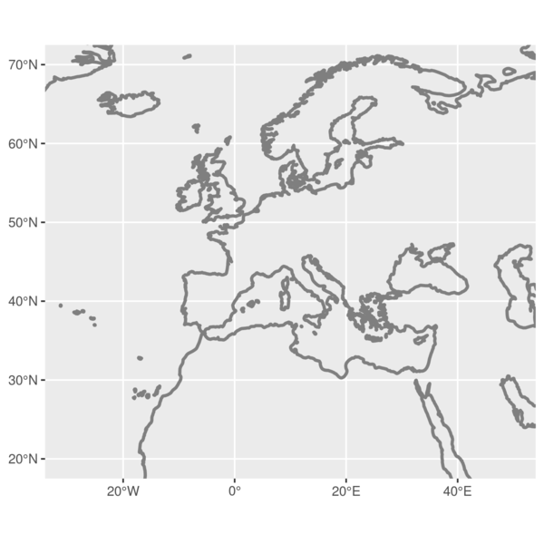

# Map building part 1

This tutorial shows how you can build a fancy map in ggplot2 and R, layer by layer. To reproduce the process load the R project and read along in the R file. For more details see our blog post.

